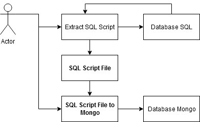
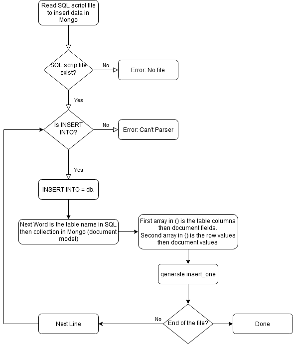

# DataManager
Tools for data handling and management.

The SQL2Mongo script was written in Python to help with data migration from SQL to MongoDB.
The use case is show in the figure below:

The input for the process is an SQL file extracted from the SQL database.

Here is the flowchart of the software process to migrate the data to MongoDB:

I hope this tool can be helpful for you as it was for me. Enjoy!

Dan
